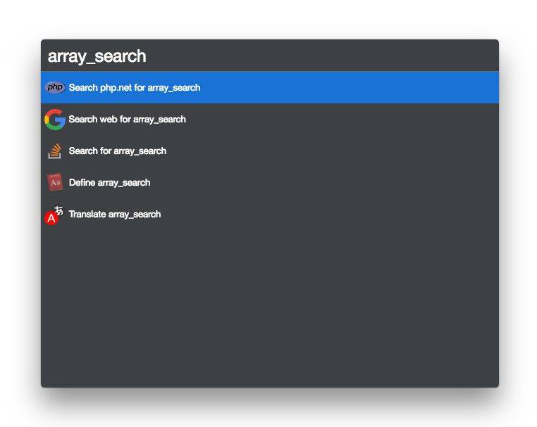

# cerebro-php

> [Cerebro](http://www.cerebroapp.com) plugin for quick access to [php.net](http://php.net) manual

## Usage

In Cerebro, type the function name and `enter` to search for it.

## Related

* [Cerebro](http://github.com/KELiON/cerebro) - main repo for Cerebro app;
* [cerebro-plugin](https://github.com/KELiON/cerebro-plugin) - boilerplace to create plugins for Cerebro app.

## License

MIT (c) [Flavio Heleno](https://github.com/flavioheleno)
